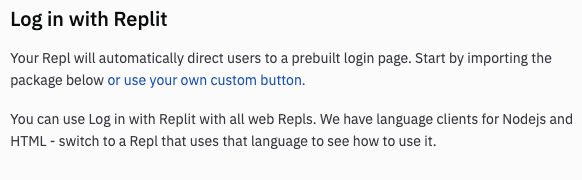
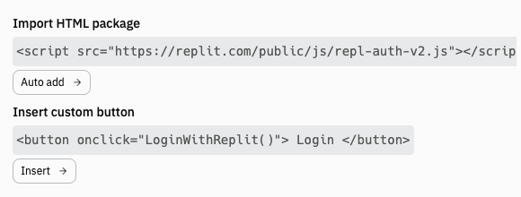

# Authentication Finesse

So far, we've used Replit authentication as a bit of a bully. It's forced users to authenticate on *every* page.

For a blog engine, this will probably put users off. We want them to be able to read your online literary genius without being turned off by having to create an account and login.

Today is all about finessing the Replit authenticator so that it works in a more subtle way.

## Custom Buttons
To start, I've turned on the authenticator from the files panel and then select `or use a prebuilt login page`. **Make sure you do this before you write any code!**

👉 This time though, I've clicked the **use your own custom button** link.


👉 Now I've got some lovely code snippets to ~~steal~~ work with.


## Add an HTML template
👉 Next I add in a HTML template page where the button will appear. The page is called `page.html` and can be found in your file tree. Here's the code:

```html
<html>
  <head>
    <title>My Website</title>
  </head>

  <body>
    <h1>Here's my site</h1>
    <p>Everyone can read this.</p>
  </body>  
</html>
```
👉 And we read that page into our `main.py` Flask code too:

```python
from flask import Flask

app = Flask(__name__)

@app.route('/')
def index():
  page = ""
  f = open("page.html", "r")
  page = f.read()
  f.close()
  return page


app.run(host='0.0.0.0', port=81)
```
## Edit page.html
👉 Let's add the authentication. To do this, I'm editing the `page.html` file. 
1. I used the **auto add** HTML package button in the authentication panel and moved the code into the header.
2. I used the **Insert Custom Button** option to add the button code to the body.

Here's the code to update in `page.html`:

```html
<html>
  <head>
    <title>My Website</title>
    <script src="https://replit.com/public/js/repl-auth-v2.js"></script>
  </head>
  
  <body>
    <h1>Here's my site</h1>
    <p>Everyone can read this.</p>
    
    <button onclick="LoginWithReplit()"> Login </button>
  </body> 
</html>
```

Stopping the code and re-running it will show you the login button on your page.

## Build a 'hello' page
👉 Now, let's build a quick 'hello' page that we can redirect a recognized user to.

1. Add the necessary imports `from flask import Flask, request, redirect`.
2. Check for a recognized user (in the `index` subroutine) and redirect if they are recognized:

```python 
def index():
  if request.headers["X-Replit-User-Name"]:
    return redirect("/hi")`
```
3. Build a quick `hi` page that displays the username:
```python
@app.route("/hi")
def hi():
  page = ""
  page += f"""<h1>{request.headers["X-Replit-User-Name"]}</h1>"""
  return page
```
4. Add a quick `if` that redirects if the user is **not** logged in. This stops the user from adding `/hi` directly to the URL to try and bypass the login.
```python
def hi():
  if not request.headers["X-Replit-User-Name"]:
    return redirect("/")
```

## Here's the whole code:

```python
from flask import Flask, request, redirect

app = Flask(__name__)

@app.route('/')
def index():
  if request.headers["X-Replit-User-Name"]:
    return redirect("/hi")

  page = ""
  f = open("page.html", "r")
  page = f.read()
  f.close()
  return page

@app.route("/hi")
def hi():
  if not request.headers["X-Replit-User-Name"]:
    return redirect("/")
  
  page = ""
  page += f"""<h1>{request.headers["X-Replit-User-Name"]}</h1>"""
  return page

app.run(host='0.0.0.0', port=81)
```

## Try it out!