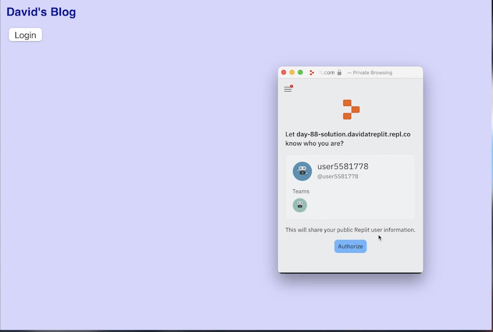

# 👉 Day 88 Challenge

Today's challenge is to adapt your blog engine again.

Your program should:

1. Allow your normal blog page to be visible to anyone, regardless of login status.
2. If a user logs in, and it's you, take them to the admin page.
3. If a user logs in, and it's not you, tell them off for being naughty! 
    
Example:



<details> <summary> 💡 Hints </summary>
  
- To check if the user is you or not (this is a generic user ID), use
```python
  userid = request.headers['X-Replit-User-Id']
  if userid != "13197838":
    return redirect("/")
```
</details>